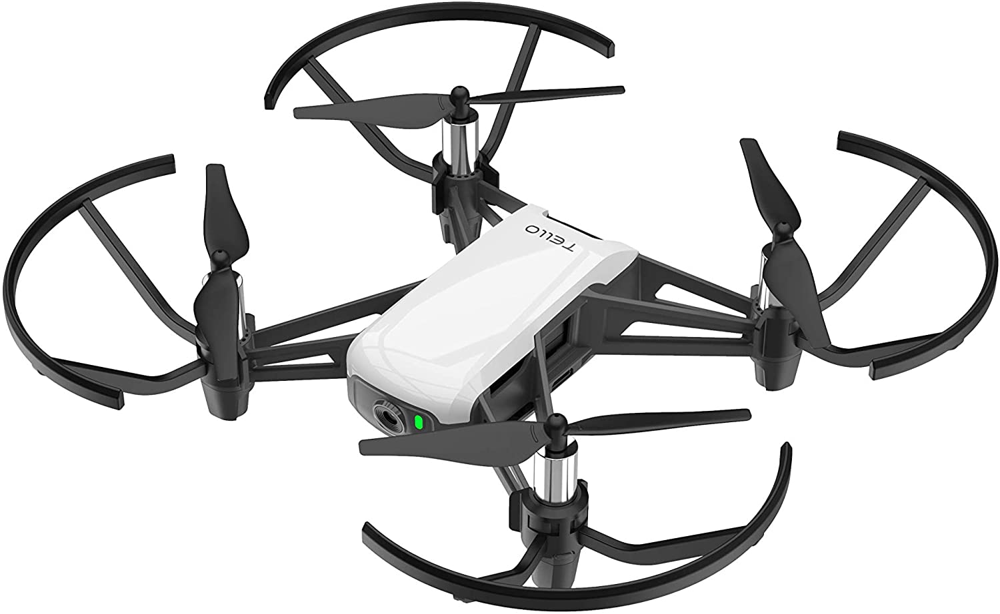
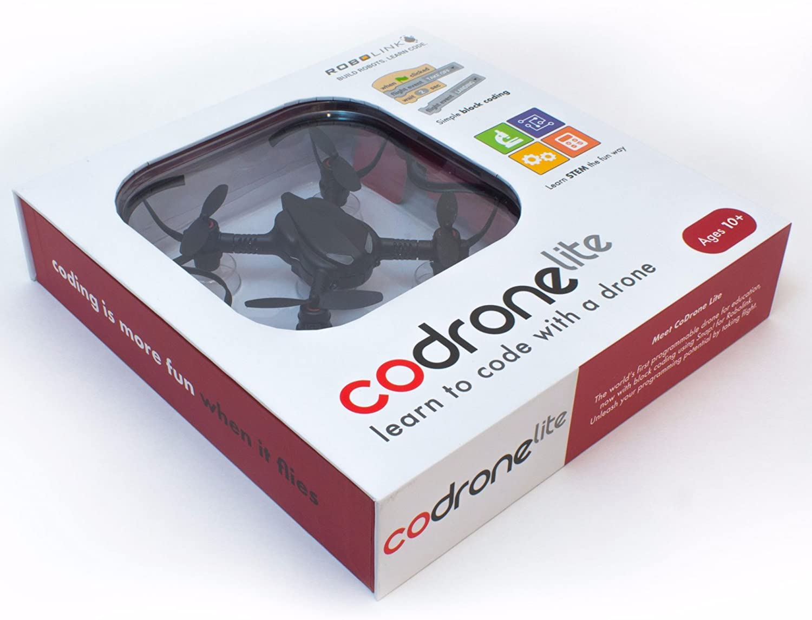
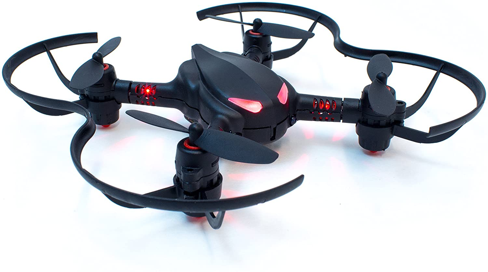

 
    
Check out:<a href='https://www.amazon.com/Tello-CP-PT-00000252-01-Quadcopter-Drone/dp/B07BDHJJTH/ref=pd_sbs_1/139-1536789-7825267?pd_rd_w=m8PNS&pf_rd_p=0f56f70f-21e6-4d11-bb4a-bcdb928a3c5a&pf_rd_r=RN4VFGT2VVS8V42T1WPJ&pd_rd_r=d6bb0712-f888-4c2d-aa44-b360530db5ec&pd_rd_wg=c2jNv&pd_rd_i=B07BDHJJTH&psc=1' class='text-2xl  text-blue-400 hover:text-white hover:underline font-bold p-2'>Ryze Tello Mini Quadcopter 
    </a>
  

</img>

Tello, a mini drone quadcopter for made for kids and beginners. Also, featured on Amazon's Best Sellers list, Tello is an inexpensive, easy to use, and easy to fly drone. With two options, of bluetooth connectivity through your smart device or Scratch which is a programming language.   
Although, there has been some negativity surrounding the low video quality, Tello has more to offer for hobbyist or educating children on what drones can offer.

 
<ol class='text-xl text-blue-400 font-bold text-center'>
    <li>Dimensions: 1.6 x 3.9 x 3.6 inches, weighs 2.8oz, and comes equipped with four rotors.</li>
    <li>Price: $99.00</li>
    <li>Features: Built in camera, programmable, and a maximum flight time of 13 minutes.</li>
</ol>

 
 
Check out:
    <a href='https://www.amazon.com/Robolink-CoDrone-Lite-Programmable-Educational/dp/B074GZ29WR/ref=pd_lpo_1?pd_rd_i=B074GZ29WR&psc=1' class='text-2xl  text-blue-400 hover:text-white hover:underline font-bold'>Robolink CoDrone Lite
     </a>
  

</img>

 
 
Check out:
    <a href='https://www.amazon.com/Robolink-CoDrone-Pro-Programmable-Educational/dp/B01K3VCN64/ref=pd_sbs_2/139-1536789-7825267?pd_rd_w=f3phb&pf_rd_p=0f56f70f-21e6-4d11-bb4a-bcdb928a3c5a&pf_rd_r=CPSTG1SEYHKQ43AJ8J49&pd_rd_r=f1aec6e4-c524-49b9-ac43-1bc86cf53f3a&pd_rd_wg=cjspm&pd_rd_i=B01K3VCN64&psc=1' class='text-2xl  text-blue-400 hover:text-white hover:underline font-bold' >Robolink CoDrone Pro</a>
    

 </img>

Robolink CoDrone Lite and Pro are the first educational drones made. Robolink built Snap! which is their own block-based coding environment with beginners in mind. The languages you can use within this environment is Python, Blocky, and Audrino(for Pro only). Both drones are very similar with a few minor differences. The Pro version comes with a buildable remote and Smart Inventor main board.  
Regardless of which drone you choose, Robolink will allow users to learn how to customize their own flight patterns, navigate through obstacles, and so much more.  

 
<ol class='text-xl text-blue-400 font-bold text-center'>
    <li>Dimensions: 5.2 x 5.2 x 1 inches, weighs 10.86oz, and comes equipped with four rotors.</li>
    <li>Price: $149.99(Lite) / $214.99(Pro) </li>
    <li>Features: Programmable, remote(for Pro only), and 8 minutes of flight time.</li>
</ol>
 

