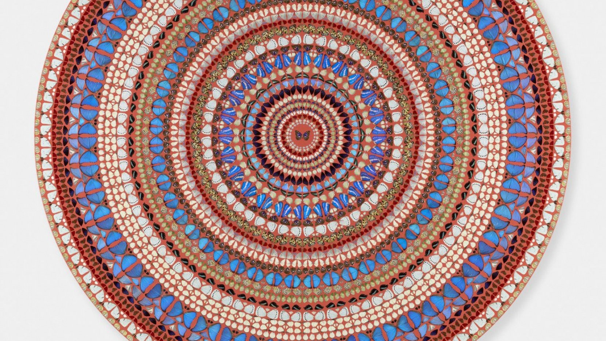
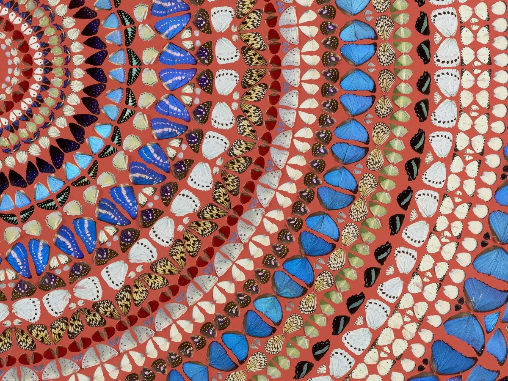

<h3 class='text-white font-bold tracking-wide text-lg p-10'>Damien Hirst - Mandalas Collection</h3>

 

<h1 class='text-white text-xl font-bold font-mono'>Dominion</h1> 
 

 Sold for 750,000 USD at Miami Beaches Art Basel in 2019.

 

One of many, Dominion (2019) made of dozens of butterfly wing fragements and gloss on canvas. Taking a look at the painting we can see another glimpses into Damien Hirst's obsession with life and death. The concentric, circular patterns gives us a Kaleidoscope vibe and is somewhat mesmerizing and meditative.
  

