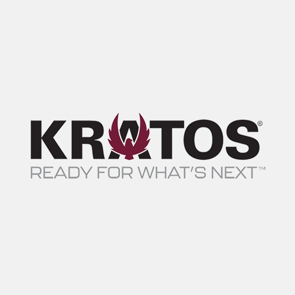

 

AeroVironment Inc. <strong class='text-blue-400'>(AVAV)</strong> is a company that specializes in unmanned aircraft systems within the aerospace and defense industry.  
They've made major moves in 2021 like snagging mutiple deals from U.S. Special Ops Command, NATO, and the U.S. Army all ranging between 7-80 million deals.  
Their Q2 for 2021 reported 1.04/earnings per share or EPS with an estimate of 0.81 and their reported revenue was 136.01 million.

 

Ambarella Inc. <strong class='text-blue-400'>(AMBA)</strong> a semiconductor design company that createsHD and ultra HD video compression, image procressing, and computer vision processors. Not a drone manufacteur but a major go to for many drone companies for its data procressing technology.
 
Their Q2 for 2021 reported 0.23/earnings per share or EPS with an estimate of 0.17 meaning they beat earnings by 0.06 per share and their revenue reported was 70.13 million which is 28% growth from the pervious YoY or year over year. 

 

Kratos Defense and Security Solutions Inc. <strong class='text-blue-400'>(KTOS)</strong> a technological defense company that works U.S. governments, allies and commercial enterprises.
 
Their Q1 for 2021 reported 0.06/earnings per share or EPS with an estimate of 0.01 meaning they beat earnings by 0.05 per share and their revenue reported was 194.2 million which is 15% growth from the pervious YoY or year over year.

